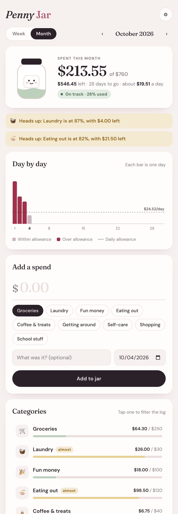
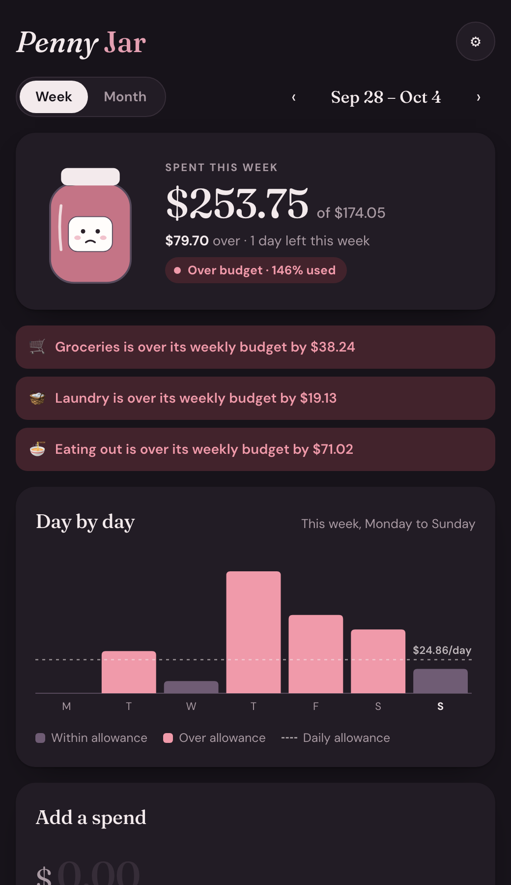

# Penny Jar

A small, friendly budget tracker. Log a spend in a few taps, set a monthly limit for each category, and get a heads-up before you go over. A little jar fills up as you spend, and its face goes from happy to worried as you get close to your budget.

  
  &nbsp;
  

## Features

- **Quick add.** Type an amount, tap a category, and you're done. A note and date are optional.
- **Category budgets.** Groceries, Laundry, Fun money, Eating out, Coffee & treats, Getting around, Self-care, Shopping, and School stuff to start. You can rename, add, or remove categories and change their emoji.
- **Week and month views.** Weekly budgets come from your monthly limits automatically. A $120 monthly limit works out to about $27 a week, and weeks that cross two months are split correctly between them.
- **Warnings.** A category shows "almost" once it reaches a threshold you choose (80% by default) and "over" once it passes 100%. A pop-up tells you right away when a spend crosses either line.
- **Day-by-day chart.** One bar per day, with a dashed line for your daily allowance. Days over the allowance are highlighted.
- **Light and dark mode.** It follows your system setting.

## Running it

It's a single file with no build step and no dependencies. Open `index.html` in any browser.

Run on its own like this, the app saves to the browser's `localStorage`, so your data stays on that one device. The version I use day to day runs as a [Claude artifact](https://claude.ai), which saves to a small cloud database instead, so my phone and laptop stay in sync. The app checks which kind of storage is available when it starts and uses that one.

## How it works

- Plain HTML, CSS, and JavaScript. No framework.
- Amounts are stored as whole cents (for example, `1250` for $12.50) to avoid rounding errors.
- Dates are stored as local `YYYY-MM-DD` strings. Weeks run Monday to Sunday.
- A category's budget for any stretch of days is its monthly limit spread evenly across that month's days. That's how weekly budgets are calculated.
- The chart is drawn as an SVG by hand. There's no charting library.
